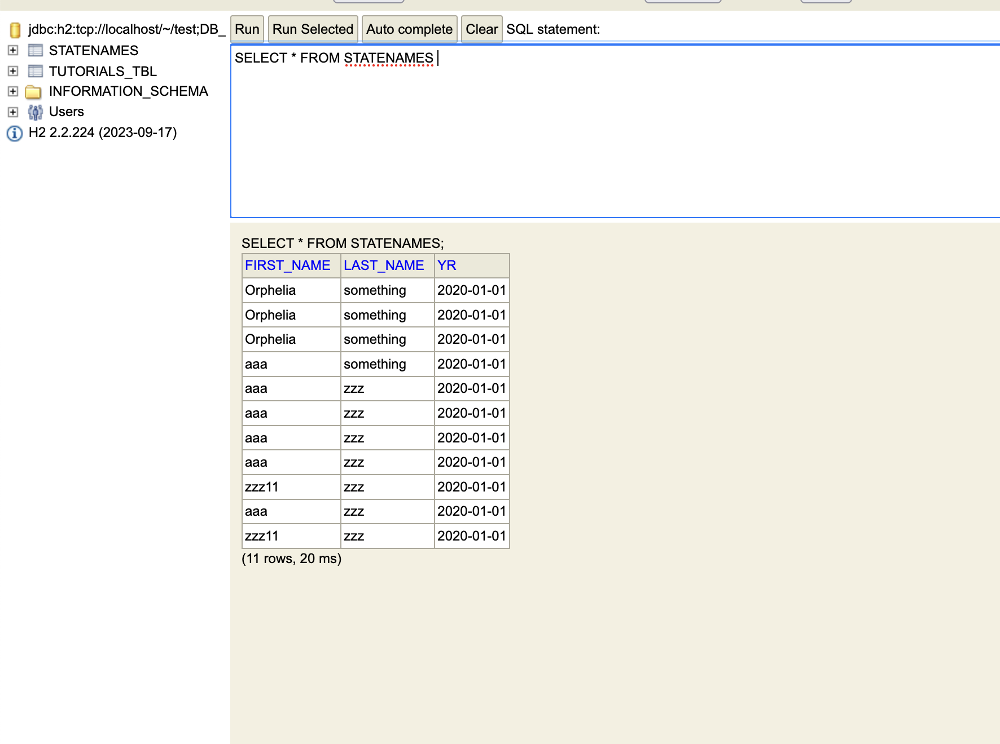
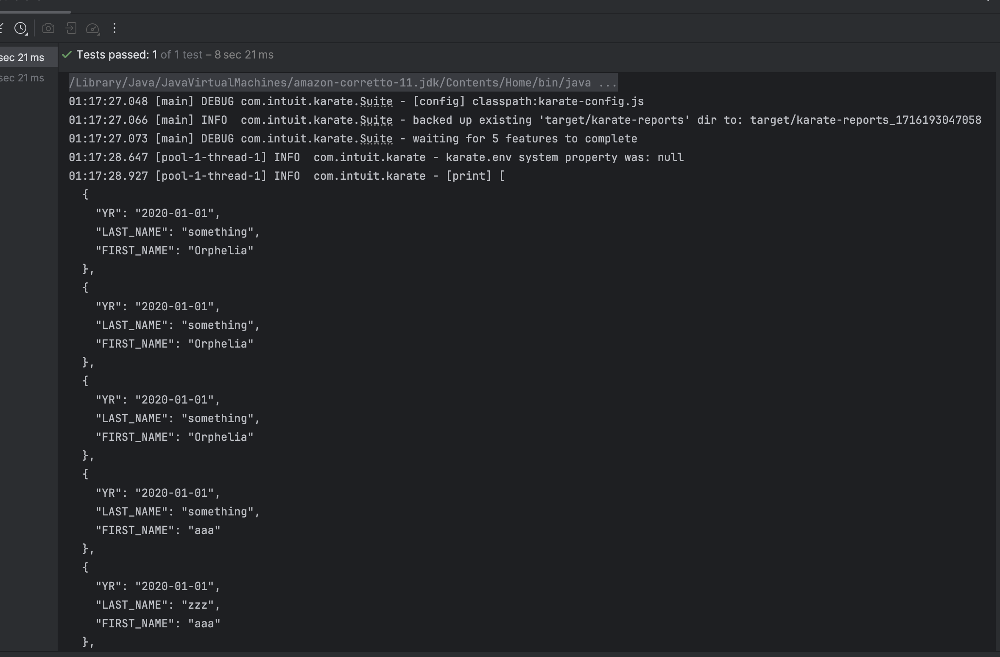

## Database Operations

### The implementation

Karate doesn't expose DB utils directly through their BDD. Hence the ideal way to do this is have java class
implementation, and then call them in the feature files. This way it's more maintainable, and easy to use. This also
makes our code error-proof.

`JDBC Lib` - There are tons of JDBC libs out there. The one I have used here is one exposed through `java.sql.*;`

### The code

Please refer to `src/test/java/framework/DBUtils.java`. Please note that this is a raw implementation. No way, this code
is production ready. This is just an implementation example.
**DB used: H2**
`Methods Exposed:`

* connectDB - Make connection to DB
* rowExists - Check if row exists if matches a condition.
* queryDB - Pass the SQL and execute
* modifyDB - update/add operation

### The DB

### The response

### DB Validator

Because the db utils - execute function returns `List<HashMap<String, Object>>`, it's easy to compare them with existing
data coming from other sources (like API's). I have created few sample methods that compare these values.
Please refer `src/test/java/framework/DBValidator.java`

### The actual BDD

Please refer `application/db/db.feature`. You set config, call the java classes needed, and then perform validations.
Not that you can do these validations through java classes, JS classes or even karate assertion clauses (like match,
assert).
