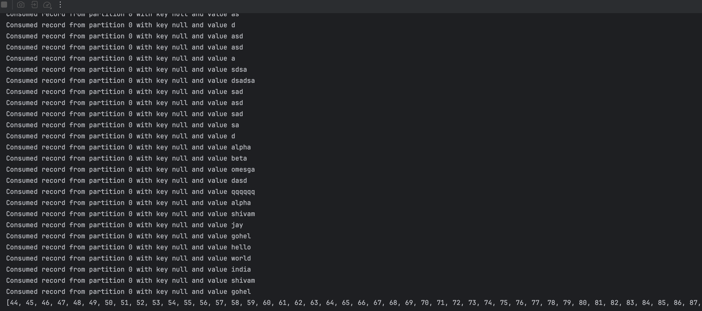

## Database Operations

### The implementation

Karate does expose kafka clauses in their BDD. But it's paid (And I am broke :D). So i went the custom route
implementation.

I have used the following lib for getting kafka utils:

```
   <dependency>
            <groupId>org.apache.kafka</groupId>
            <artifactId>kafka-clients</artifactId>
            <version>3.7.0</version> 
        </dependency>
```

### The code

Please refer to `src/test/java/framework/KafkaUtils.java`. Please note that this is a raw implementation. No way, this code
is production ready. This is just an implementation example.
`Methods Exposed:`

* readMessages - Read messages from a given topic last X seconds ago (from all parition)
* consumeMessages - Read last X messages from all parition
* produceMessages - produce messages in a particular topic

### The response



### Kafka Validations
- Ideally I would need consumer the most. I would consume messages sent last X seconds ago, or fetch last X messages, and then compare them with my API response, DB response.
Also because the methods returns a list, it's easy to search for a particular message. 


### The actual BDD

Please refer `application/kafka/kafka.feature`. You set config, call the java classes needed, and then perform validations.
Not that you can do these validations through java classes, JS classes or even karate assertion clauses (like match,
assert). *This code is not functional, it's a template*
